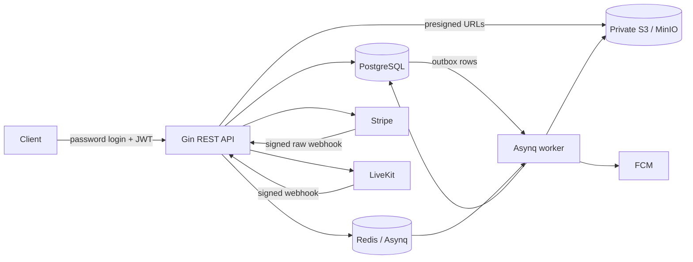

# Architecture

## Decision

Phase 1 is one deployable modular monolith with separate API, worker, migration, seed, and one-time administrator-bootstrap entrypoints. Modules share PostgreSQL but own their business rules and queries. Cross-domain workflows such as payment plus enrollment and completion plus result/certificate remain transactional without distributed coordination.

## Boundaries

`cmd/*` contains explicit composition roots. `internal/modules` contains application services, domain decisions, consumer-owned interfaces, and thin HTTP adapters. `internal/platform` owns configuration and external adapters for PostgreSQL, Redis, JWT/Argon2id, payment, LiveKit, object storage, notification delivery, jobs, clocks, identifiers, logs, metrics, and tracing.

SQL is explicit in `queries/` and generated by sqlc into `internal/data/`; generated files are never hand-edited. Gin owns routing and middleware. Existing net/http-compatible handlers are adapted at the transport edge only; domain and application services do not import Gin or infrastructure SDKs.

The API never runs migrations. `cmd/migrate` is a one-shot deployment command so multiple replicas cannot race migration ownership.

## Transaction boundaries

- Registration writes the pending account, student roles/profile, default membership, hashed verification token, and audit event atomically.
- Refresh rotation locks the presented session; reuse revokes the entire family and records a security audit event.
- Course optimistic updates compare `version`; moderation changes write audit history in the same transaction.
- Quiz submission locks the attempt, scores its immutable snapshot, and finalizes once.
- Assignment grading locks the submission, upserts the grade, changes state, and emits completion work.
- Payment success locks the order, validates amount/currency, records the unique provider event/transaction, activates enrollment, and writes an outbox event.
- Completion locks enrollment, recalculates required components, stores a result, creates at most one certificate, and emits generation work.

## Failure model

External calls do not hold database transactions open. Payment webhooks, not client responses, authorize paid enrollment. Object storage is verified before an upload becomes ready. Asynq tasks and outbox delivery are replay-safe. Delivery retries use bounded exponential backoff and terminal dead-letter state. PostgreSQL remains authoritative if Redis or a notification provider is unavailable.

## Security model

Short-lived access JWTs validate algorithm, key ID, issuer, audience, type, and lifetime. Opaque refresh/reset/verification tokens are stored only as hashes. Every authenticated request reloads active account state and global roles from PostgreSQL, then resolves an active organization membership. Resource checks enforce course ownership, enrollment, submission/attempt ownership, media relationships, and server-authoritative prices, scores, rooms, completion states, and grants.
