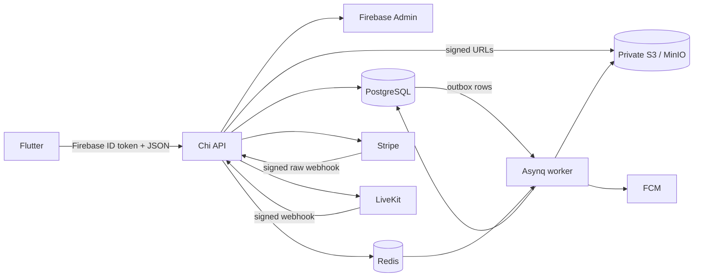

# Architecture

## Decision

Phase 1 is one deployable modular monolith with separate API, worker, migration, and seed entrypoints. Modules share one PostgreSQL database but own their domain rules and queries. This keeps cross-domain transactions—payment plus enrollment, completion plus certificate, notification plus outbox—atomic without distributed coordination.

## Boundaries

`internal/platform` owns configuration and external adapters. Firebase, payment, LiveKit, object storage, notifications, jobs, clocks, and identifiers are constructor-injected. Tests use fakes at those consumer boundaries.

`internal/modules` owns organization, course, media, enrollment, progress, quiz, assignment, live-class, certificate, payment, notification, and reporting behavior. SQL is explicit in `queries` and generated into `internal/data`; generated files are never hand-edited.

The API process never runs migrations. `cmd/migrate` is an explicit deployment step so several API replicas cannot race migration ownership.

## Transaction boundaries

- Invitation acceptance locks the invitation, checks expiry and authenticated email, then creates membership and role.
- Course optimistic updates compare `version`; sensitive updates write an audit row in the same transaction.
- Quiz submission locks the attempt, grades snapshot questions, and finalizes the score once.
- Assignment grading locks the submission, upserts the grade, changes state, and queues completion evaluation.
- Payment success locks the order, validates provider amount/currency, records the provider event/transaction, marks the order paid, creates enrollment, and inserts an outbox event.
- Completion locks enrollment, rechecks every requirement, marks completion, creates exactly one certificate, and inserts an outbox event.
- Webhook provider IDs, order idempotency keys, enrollment keys, certificates, and outbox deduplication keys are protected with unique constraints.

## Failure model

External calls do not hold database transactions open. Stripe intent creation is followed by an idempotent database update. Webhooks are the authority for payment activation. Object storage is verified before media becomes processable. Outbox events retry with exponential backoff and delivery deduplication. Asynq tasks are safe to replay because handlers inspect current database state.

## Security model

Authentication identifies a Firebase principal, then upserts its local record. Authorization reads active organization membership and roles from PostgreSQL on each request. Course assignment, enrollment ownership, submission ownership, and media relationships add resource-level checks. Client-supplied organization IDs, prices, scores, room names, completion states, or LiveKit grants are never authoritative.
