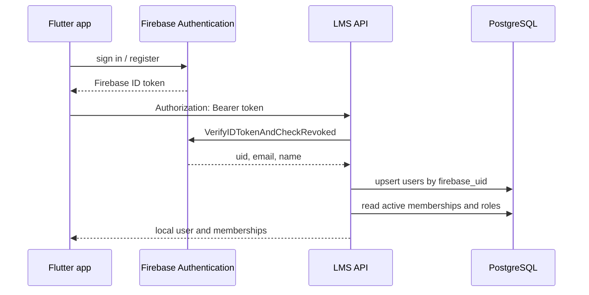

# Authentication

## Firebase flow



No Firebase password, refresh token, or second application JWT is stored or issued. Local status can suspend or delete access immediately. Role changes take effect on the next request because roles are read from PostgreSQL rather than Firebase custom claims.

Production uses Application Default Credentials. For local real-Firebase testing, point `GOOGLE_APPLICATION_CREDENTIALS` at a file outside the repository and set `FIREBASE_PROJECT_ID`. Verify a real Flutter token with:

```bash
curl -X POST "$PUBLIC_API_URL/api/v1/auth/bootstrap" \
  -H "Authorization: Bearer $FIREBASE_ID_TOKEN"
```

The bootstrap and sensitive paths are Redis-rate-limited. Revoking sessions calls Firebase Admin `RevokeRefreshTokens`; already issued tokens are checked for revocation by the verifier.

## Development fake identity

`dev:<email>` tokens are accepted only if `APP_ENV` is `development` or `test` and `FAKE_AUTH_ENABLED=true`. Configuration validation refuses fake authentication in production. Seeded users have deterministic development UIDs derived from normalized email.

## Invitations

Invitation tokens contain at least 256 random bits. PostgreSQL stores only their SHA-256 hashes. Acceptance locks the invitation, verifies pending status and expiry, and compares the authenticated Firebase email case-insensitively. Membership and role are created in that transaction.

## First production administrator

1. Apply migrations.
2. Create or identify the administrator in the correct Firebase project and copy the UID/email from Firebase Admin.
3. Export production configuration plus:

```bash
export BOOTSTRAP_ADMIN_CONFIRM=CREATE_FIRST_SUPER_ADMIN
export BOOTSTRAP_FIREBASE_UID='firebase-uid-from-admin-console'
export BOOTSTRAP_EMAIL='admin@example.com'
export BOOTSTRAP_DISPLAY_NAME='Platform Administrator'
export BOOTSTRAP_ORGANIZATION_NAME='Initial Organization'
export BOOTSTRAP_ORGANIZATION_SLUG='initial-organization'
go run ./cmd/bootstrap-admin
```

The command locks its work in one transaction and refuses to run when an active super administrator already exists. It never accepts a password.
