# Entity relationship model

The migration is authoritative; this diagram groups the primary relationships for readability.

```mermaid
erDiagram
  ORGANIZATIONS ||--o{ ORGANIZATION_MEMBERSHIPS : has
  USERS ||--o{ ORGANIZATION_MEMBERSHIPS : joins
  ORGANIZATION_MEMBERSHIPS ||--o{ MEMBERSHIP_ROLES : grants
  ROLES ||--o{ MEMBERSHIP_ROLES : assigned
  ROLES ||--o{ ROLE_PERMISSIONS : contains
  PERMISSIONS ||--o{ ROLE_PERMISSIONS : permits
  ORGANIZATIONS ||--o{ USER_INVITATIONS : sends
  ORGANIZATIONS ||--o{ COURSES : owns
  COURSE_CATEGORIES ||--o{ COURSES : categorizes
  COURSES ||--o{ COURSE_INSTRUCTORS : assigns
  USERS ||--o{ COURSE_INSTRUCTORS : teaches
  COURSES ||--o{ COURSE_MODULES : contains
  COURSE_MODULES ||--o{ LESSONS : contains
  MEDIA_ASSETS ||--o| LESSONS : supplies
  MEDIA_ASSETS ||--o| UPLOAD_INTENTS : uploaded_by
  COURSES ||--o{ ENROLLMENTS : receives
  USERS ||--o{ ENROLLMENTS : learns
  ENROLLMENTS ||--o{ LESSON_PROGRESS : tracks
  LESSONS ||--o{ LESSON_PROGRESS : completed
  COURSES ||--o{ QUIZZES : assesses
  QUIZZES ||--o{ QUIZ_QUESTIONS : asks
  QUIZ_QUESTIONS ||--o{ QUIZ_QUESTION_OPTIONS : offers
  QUIZZES ||--o{ QUIZ_ATTEMPTS : attempted
  QUIZ_ATTEMPTS ||--o{ QUIZ_ANSWERS : answers
  COURSES ||--o{ ASSIGNMENTS : assesses
  ASSIGNMENTS ||--o{ ASSIGNMENT_ASSETS : attaches
  MEDIA_ASSETS ||--o{ ASSIGNMENT_ASSETS : supplies
  ASSIGNMENTS ||--o{ ASSIGNMENT_SUBMISSIONS : receives
  ASSIGNMENT_SUBMISSIONS ||--o{ ASSIGNMENT_SUBMISSION_ASSETS : attaches
  MEDIA_ASSETS ||--o{ ASSIGNMENT_SUBMISSION_ASSETS : supplies
  ASSIGNMENT_SUBMISSIONS ||--o| GRADES : graded
  COURSES ||--o{ LIVE_SESSIONS : schedules
  LIVE_SESSIONS ||--o{ LIVE_ATTENDANCE_SESSIONS : records
  ENROLLMENTS ||--o| CERTIFICATES : awards
  ORDERS ||--|{ ORDER_ITEMS : snapshots
  ORDERS ||--o{ PAYMENT_TRANSACTIONS : records
  ORDERS ||--o{ REFUNDS : refunds
  USERS ||--o{ NOTIFICATIONS : receives
  NOTIFICATIONS ||--o{ NOTIFICATION_DELIVERIES : delivers
  USERS ||--o{ DEVICE_TOKENS : registers
```

All identifiers generated by application paths are UUIDv7. All timestamps are `timestamptz` and application clocks use UTC. Decimal grades use `NUMERIC`; money uses integer minor units plus an uppercase ISO currency.
