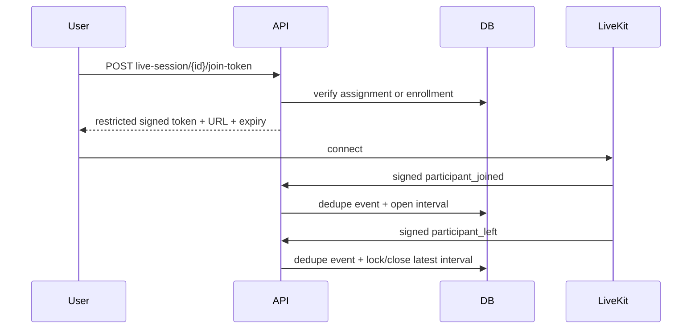

# Live classes

LiveKit is behind `LiveClassProvider`. The production adapter signs standard participant tokens; tests use a fake.

The backend generates every room name. Instructor publish grants require an active instructor assignment. Student grants disable publishing and require active enrollment. Clients never supply a room or grant set.

Reconnects create new attendance intervals. Leaves close only the latest open interval and calculate a non-negative duration. Reports sum intervals, so reconnects neither overwrite earlier attendance nor count disconnected time.

Verify production by creating a session, joining once as an assigned instructor and once as an enrolled student, and confirming signed webhook events appear uniquely in `live_webhook_events` with matching attendance intervals.
