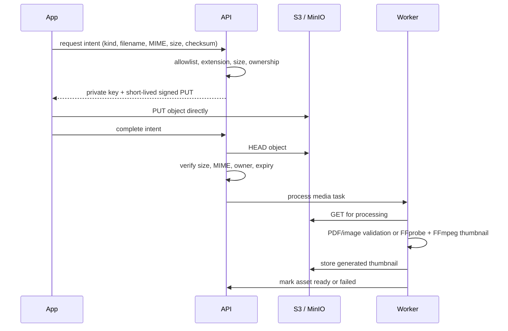

# Media upload and delivery

Large bodies never traverse the API process.

Allowed client kinds are MP4 video, PDF, JPEG/PNG/WebP thumbnails, and a constrained assignment allowlist. Certificate assets are worker-created only. `filepath.Base`, extension/MIME matching, generated storage keys, and database constraints prevent traversal and key injection.

Completion is idempotent. A duplicate completion reads the existing asset. An expired, wrong-size, or wrong-MIME object remains unavailable. Worker failures store a bounded failure reason and can be retried after correcting operational dependencies.

Video metadata uses `ffprobe`; thumbnails use `ffmpeg`. The runtime image includes both. Phase 1 returns short-lived signed MP4 URLs; the object store handles HTTP ranges. There is no pretend HLS layer. Lesson JSON already reserves subtitle and alternate-audio track metadata for a future transcoding pipeline.

All buckets remain private. Signed downloads are issued only after preview, enrollment, ownership, assigned-instructor, or administrator checks.
