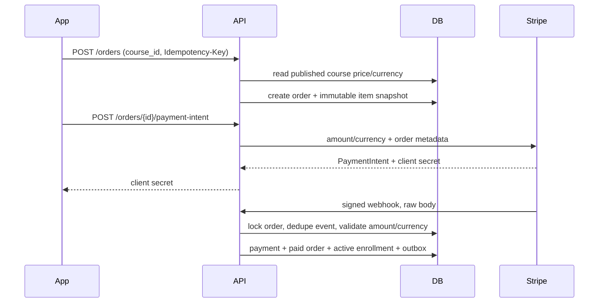

# Payments

## Purchase flow



The client never sends an authoritative amount. A mobile success screen cannot activate enrollment. Only a signature-verified `payment_intent.succeeded` webhook can do so.

Development and test use the in-process fake payment adapter, while production always constructs the real Stripe adapter and requires its secrets. The smoke test signs a fake success event, delivers it twice, and verifies that one active enrollment results.

Provider event IDs, transaction IDs, PaymentIntent IDs, and user/idempotency-key pairs are unique. Duplicate webhook delivery returns success without replaying state changes. Order/payment/enrollment updates share one PostgreSQL transaction.

Webhook testing with Stripe CLI:

```bash
stripe listen --forward-to localhost:8080/api/v1/webhooks/stripe
stripe trigger payment_intent.succeeded
```

Use the CLI-provided `whsec_...` only in local environment configuration. Never log `Stripe-Signature`, client secrets, card data, API keys, or webhook secrets.

Refunds are provider-authoritative records in `refunds` and `payment_transactions`. Expand the provider adapter with an authenticated refund command when automated refund initiation enters product scope; Phase 1 records provider refund events and exposes organization-scoped revenue/refund reporting.
