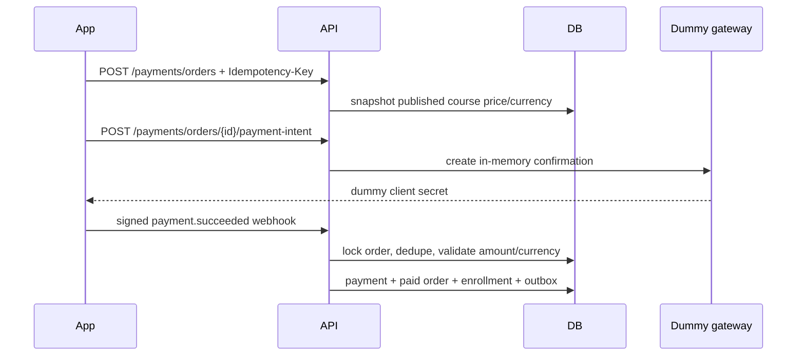

# Development dummy payments

The current payment adapter is intentionally local-only. It never connects to
a processor, accepts card information, or represents real settlement.
`APP_ENV=production` is rejected until an approved production adapter replaces
it.

## Purchase flow



The client never sends an authoritative price and a success screen cannot
activate enrollment. Activation requires a signed, timestamp-bounded webhook:

```http
POST /api/v1/payments/webhooks/dummy
X-Dummy-Payment-Signature: t=<unix-seconds>,v1=<hmac-sha256>
Content-Type: application/json

{
  "id": "dummy_evt_unique",
  "type": "payment.succeeded",
  "payment_id": "dummy_pi_<order-uuid>",
  "order_id": "<order-uuid>",
  "status": "succeeded",
  "amount_minor": 100000,
  "currency": "BDT"
}
```

The HMAC input is `<timestamp>.<raw-body>` and the key is
`DUMMY_PAYMENT_WEBHOOK_SECRET`. The supported event types are
`payment.succeeded`, `payment.failed`, and `payment.refunded`.

Event IDs, transaction IDs, dummy payment IDs, and user/idempotency-key pairs
are unique. Replayed webhooks return success without replaying state changes.
The smoke test delivers the same signed event twice and verifies that exactly
one active enrollment results.
